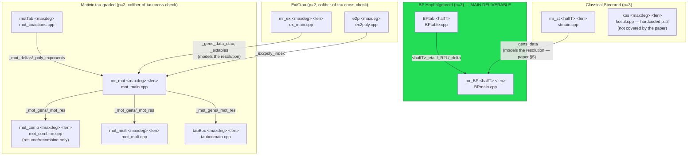

# Architecture

This document is the map of the whole repository: what it computes, how its
11 build targets relate, and where the actual prime `p` each computation runs
at diverges from the "p=3 fork" framing in the top-level README. It assumes
you'll click through to the detail docs for anything beyond the big picture:

- [`FRAMEWORK.md`](FRAMEWORK.md) — the generic, math-agnostic template layer
  (rings, modules, matrices, comodules, `Hopf_Algebroid`, `curtis_table`).
- [`pipelines/STEENROD.md`](pipelines/STEENROD.md) — `mr_st`, `kos`.
- [`pipelines/BP.md`](pipelines/BP.md) — `BPtab`, `mr_BP` (the repo's main deliverable).
- [`pipelines/MOTIVIC.md`](pipelines/MOTIVIC.md) — `motTab`, `mr_mot`, `mot_comb`, `mot_mult`, `tauBoc`.
- [`pipelines/EX_CTAU.md`](pipelines/EX_CTAU.md) — `mr_ex`, `e2p`.
- [`BUILD_AND_RUN.md`](BUILD_AND_RUN.md) — concrete build/run instructions.
- [`CLASSES.md`](CLASSES.md) — full class catalog across all four docs.
- [`GLOSSARY.md`](GLOSSARY.md) — math term ↔ code identifier index.

This document, and the rest of the `docs/` tree, is now grounded in
**`MinimalResolution.pdf`** (Guozhen Wang, *Computations of the Adams-Novikov
E2-term*, April 2020), which the repo owner added after the rest of this
documentation was first written. Every claim below cites a definition,
proposition, or section of that paper where one exists; anywhere the paper
is silent (mostly: the ex/ctau, motivic, and Koszul side-pipelines, which
postdate the paper's own §9 source walkthrough), that's called out
explicitly rather than guessed at.

## 1. What this repo computes

This is Guozhen Wang's minimal-resolution machinery for computing the
**Adams–Novikov E2 page for the sphere spectrum**, forked to the prime 3, via
the **algebraic Novikov spectral sequence**. Precisely (paper, §2 "Notation"
and §7):

- `BP` is the Brown–Peterson spectrum, a complex-oriented ring spectrum whose
  formal group law is the universal `p`-typical one over `Z_(p)`, with
  `BP_* = Z_(p)[v1, v2, ...]` and `BP_*BP = BP_*[t1, t2, ...]`.
- `I = (p, v1, v2, ...)` is the invariant regular ideal, and
  `P := BP_*BP/I = F_p[t1, t2, ...]` — reduction mod `I` turns the Hopf
  algebroid `(BP_*, BP_*BP)` into the Hopf **algebra** `P`, which the paper
  states is **a sub-Hopf-algebra of the dual Steenrod algebra, and at `p=2`
  is isomorphic to the whole dual Steenrod algebra with degrees doubled**
  (paper §2). This is the precise sense in which `P` — the object the
  classical Steenrod pipeline (`mr_st`) resolves — relates to `BP_*BP`; see
  §5 below.
- The **algebraic Adams-Novikov filtration** (paper §7) filters the
  primitives of a `BP_*BP`-comodule resolution by powers of `I`: writing
  a primitive as a linear combination of `v0^{i0} v1^{i1} ··· vk^{ik} · a`
  (convention `v0 = p`, `a` a chosen `BP_*`-generator), its filtration degree
  is `i0 + i1 + ... + ik`. Reading off the Curtis table of this filtered
  complex (§2 below) gives exactly `algNov_table` (`docs/pipelines/BP.md`
  §3) — this **is** the algebraic Novikov spectral sequence, computed here
  as a byproduct of minimal-resolution machinery rather than the classical,
  much slower route of computing directly in the cobar complex (paper §1,
  citing Ravenel [3]).

The BP pipeline (`BPtab` → `mr_BP`) is the actual deliverable; everything
else in the repo is either infrastructure it's built on (the generic
framework), a necessary precomputation the BP pipeline's own optimization
depends on (`mr_st`, see §5), or an independent cross-check computed via a
different route through motivic homotopy theory (the ex/ctau + motivic
pipelines, `kos`; see §6).

## 2. Mathematical background (from `MinimalResolution.pdf`)

The paper's core contribution, in the order it's presented, with pointers to
which classes implement each piece:

1. **Minimal resolutions are defined via reduction mod `I`.** A cofree
   resolution of a `BP_*BP`-comodule `M` (free over `BP_*`) is *minimal* if
   its reduction mod `I` is a minimal resolution of the `P`-comodule `M/I`
   (Definitions 6–7); a resolution of a `P`-comodule is minimal if, at every
   stage, `Prim(M̃_i) → Prim(F̃_i)` is bijective. This is exactly the
   termination criterion `Hopf_Algebroid::embed2cofree` implements via
   `curtis_table::simplify_to_led` (`FRAMEWORK.md` §5): a new cofree
   generator is added only when the current partial embedding fails to
   reduce a basis element to zero, i.e. exactly when it's *not yet* in the
   image — the bijective-on-primitives condition, checked one generator at
   a time.
2. **Cogenerators and the adjoint map.** A map `f : M → X` exhibits `X` as
   cogenerators of `M` iff the adjoint `M → BP_*BP ⊗_{BP_*} X` is strongly
   injective (a split injection of underlying `BP_*`-modules), and — crucially
   — this holds **iff its reduction mod `I` does** (Definition 2, Remark 3.1,
   Propositions 3, 8). This is exactly `Hopf_Algebroid::adjoint`
   (`FRAMEWORK.md` §5) and is *why* checking things via `curtis_table`
   reduction (a `P`/mod-`I` computation) correctly certifies properties of
   the integral `BP_*BP` resolution.
3. **Curtis tables compute homology of any filtered complex** (§6, citing
   Curtis–Goerss–Mahowald–Milgram [1] — the origin of the `curtis_table`
   name). Given a complex of locally finite modules with a compatible
   maximal filtration, a unique table of entries `a` (surviving cycle) or
   `a → b` (differential) exists (Proposition 9) and, when a coarser
   filtration is refined by the maximal one, the table's `a` entries are
   exactly the permanent cycles and its `a → b` entries the differentials of
   the spectral sequence for that coarser filtration (Proposition 10). This
   is the general machinery `curtis_table`/`SS_table` implement
   (`FRAMEWORK.md` §3), and it's *why* the same table structure serves both
   as a resolution's bookkeeping and as `algNov_table`/`Boc_table`'s
   spectral-sequence storage.
4. **The algebraic Novikov and Bockstein spectral sequences are the same
   construction with two different term orders** on the same minimal
   resolution's primitives (§7, Remark 7.1): order by
   `(Adams-Novikov filtration, then lexicographic)` for the algebraic
   Novikov SS, or by **lexicographic order directly** for the Bockstein SS.
   This is exactly the difference between `algNov_table` and `Boc_table`
   (`docs/pipelines/BP.md` §3/§6): `Boc_table::v_valuation` counts only
   powers of `p` (`v0`), which is the lexicographic-primarily-by-`p`-power
   ordering the paper describes.
5. **Multiplicative structure is Atiyah-Hirzebruch, and AHSS differentials
   are multiplication by an extension class** (§8, Proposition 12): for a
   two-step filtration `0 → BP_* → M → Σ^j BP_* → 0` classified by
   `h ∈ Ext^{j,1}(BP_*)`, the Atiyah-Hirzebruch differentials for `M`
   correspond exactly to multiplication by `h`. This is the mathematical
   content of `BP_Op::h0()`/`BP_Op::thetas()` and `multiplication.cpp`
   (`docs/pipelines/BP.md` §3/§6): each is the extension class of a specific
   two-step (or iterated) filtration on the resolution, and the code
   computes multiplication tables by this recipe rather than by directly
   constructing Massey products.

## 3. The four-layer structure

```
┌─────────────────────────────────────────────────────────────────────┐
│  Layer 4: concrete pipelines (each ties a ring + Hopf-algebroid       │
│  structure + a main() driver to the framework below)                 │
│                                                                       │
│    Steenrod (p=3)      BP (p=3)         Ex/Ctau (p=2)   Motivic (p=2)│
│    steenrod.*           BP.*, BPQ.*      ctau_steenrod.* mot_steenrod.*│
│    steenrod_init.*      BP_init.*        ex_steenrod_init.* tao_bockstein.*│
│    stmain.cpp           BPmain.cpp       ex_main.cpp     mot_main.cpp │
│    kosul.cpp            BPtable.cpp                      + 4 more    │
├─────────────────────────────────────────────────────────────────────┤
│  Layer 3: base rings                                                 │
│    Fp (F_p field)   Z3 (3-adic ints)   Qp/Q3 (p-local rationals, GMP)│
├─────────────────────────────────────────────────────────────────────┤
│  Layer 2: generic algebraic structures (math-agnostic, templated)    │
│    RingOp/AbGroupOp · ModuleOp · matrix (mem/stream/file backends)   │
│    polynomial/PolyOp_Para · CoModule/comodule_generic/cofree_comodule│
│    Hopf_Algebroid  (the resolution ALGORITHM lives here)             │
│    curtis_table (mem/stream backends) · SS_table · monomial_index    │
├─────────────────────────────────────────────────────────────────────┤
│  Layer 1: plumbing                                                   │
│    con_streams/con_fstreams (thread-safe file/stream IO)             │
└─────────────────────────────────────────────────────────────────────┘
```

Every concrete pipeline instantiates `Hopf_Algebroid<ring, algebroid>` for
its own ring/algebroid pair and gets the entire resolution algorithm
(`embed2cofree`, `resolvor`, `pre_resolution_tab`, `quotient`, ...) for free —
see `FRAMEWORK.md` §5 for exactly what that algorithm computes, now grounded
in the paper's Definitions 6–7 and Propositions 3/8 (§2 above) rather than
left as an open question.

## 4. Executable pipeline and data flow

11 build targets total (9 "primary" executables plus 2 upstream helper tools,
`motTab` and `e2p`, that other docs found were required but not in the
original brief):



Notes on this diagram:
- **Solid arrows** are confirmed file-based dependencies (cited with
  file:line in the pipeline docs); the `mr_st → mr_BP` edge, previously
  drawn dotted as an inferred connection, is now solid — see §5.
- `kos` and the four `mr_ex`/`e2p` boxes are *not* wired into the BP
  pipeline's data flow at all; they're an independent cross-check that
  happens to reuse the same generic framework — see §6.
- `BPtab`/`mr_BP` is the only pipeline entirely self-contained and running at
  the prime the repo claims to be forked to (p=3) — see §6.

## 5. Resolving the `mr_st` ↔ `mr_BP` connection

`docs/pipelines/BP.md` previously flagged as an open question why no code in
`BP.cpp`/`BP_init.cpp` visibly loads any `mr_st` output file, even though the
README lists `mr_st` as a prerequisite phase ("the minimal resolution for
BP/I"). The paper's **§5, "Optimization of the process"**, resolves this
directly — it is exactly the technique implemented here:

> "The complexity of computing a minimal resolution of `M/I` has smaller
> order than computing a minimal resolution of `M`. So the process can be
> optimized by computing a minimal resolution of `M/I` first, and then using
> it as a model for a resolution of `M`."

Concretely:

- `mr_st` (`docs/pipelines/STEENROD.md` §2) computes a minimal resolution of
  the trivial `P`-comodule `F_3` — i.e. of `M/I` for `M = BP_*` — and writes
  `<maxdeg>_gens_data` via `SteenrodInit::save_gens` (`steenrod_init.cpp:60-70`).
  This is precisely "step 1" and "step 2" of the paper's §4 construction,
  "computed beforehand" as the optimization describes.
- `mr_BP` (`docs/pipelines/BP.md` §2.2) *requires* that same
  `<halfT>_gens_data` via `BPInit::load_gens` (`BPmain.cpp:23`,
  `BP_init.cpp:82-95`) — a file `BPtab` never produces — and uses it to
  **lift** the known `P`-comodule resolution structure to an actual
  `BP_*BP`-comodule resolution of `BP_*`, doing Gaussian elimination only for
  the (much smaller) adjustment data (paper §5, steps 3–4). In the code this
  is the `resolvor_modeled`/`pre_resolution_modeled` path
  (`FRAMEWORK.md` §5), with `mr_st`'s resolution as the "model."
- **Why this is valid, precisely:** because minimality of a `BP_*BP`-comodule
  resolution is *defined* as minimality of its mod-`I` reduction (Definition
  7), a resolution of `M/I` that is already known to be minimal, together
  with cogenerators that are known (Proposition 8) to lift correctly because
  they do so mod `I`, is enough data to build the integral resolution
  without re-deriving its shape from scratch — only the specific lift (which
  generator maps to which integral element) needs computing. This is the
  same justification `MOTIVIC.md` §2's `mr_ex → mr_mot` "modeled resolution"
  relies on, and the same mechanism `FRAMEWORK.md` §5's
  `resolvor_modeled`/`pre_resolution_modeled` implement generically.

## 6. The "p=2 vs p=3" split — now explained, not just observed

Despite the repo's framing as **"a p=3 fork"** of the original p=2 codebase,
cross-referencing all four pipeline docs shows the fork is **partial** — and
the paper explains *why*, rather than leaving it a mystery:

| Pipeline | Executable(s) | Prime | Role |
|---|---|---|---|
| Classical Steenrod | `mr_st` | **3** | Precomputes the "model" resolution `mr_BP` lifts (§5 above) — ported to p=3 because `mr_BP` needs it. |
| BP Hopf algebroid | `BPtab`, `mr_BP` | **3** | **The direct computation** — the repo's actual deliverable. |
| Koszul | `kos` | 2 | Not documented in the paper at all (its §9 source walkthrough stops before `kosul.cpp`); purpose still open, see `STEENROD.md` §5–6. |
| Ex/Ctau | `mr_ex` | 2 | An **independent cross-check**, computed via motivic homotopy theory rather than directly over `BP_*BP` — see below. |
| Motivic | `motTab`, `mr_mot`, `mot_comb`, `mot_mult`, `tauBoc` | 2 | Same cross-check, continued. |

The paper's introduction states the motivation for that cross-check
explicitly, citing Gheorghe–Wang–Xu [2]:

> "it is proved in [2] that the algebraic Novikov spectral sequence for the
> sphere is isomorphic to the motivic Adams spectral sequence for the
> cofiber of τ."

That is: the ex/ctau + motivic + τ-Bockstein machinery (`docs/pipelines/
MOTIVIC.md`, `docs/pipelines/EX_CTAU.md`) is not an unfinished or unrelated
side project — it's a **second, independently-implemented route to the same
E2 page** the BP pipeline computes directly, via the motivic Adams spectral
sequence for the cofiber of τ, which [2] proves is isomorphic to the
algebraic Novikov SS for the sphere. The paper's own §9 source-code
walkthrough only documents files through `Qp.h`/`BPQ.h`/`Z2.h` (the original
p=2 codebase's direct-BP\-pipeline files) and never mentions `ex_*.cpp`,
`ctau_steenrod.*`, `mot_*.cpp`, `tao_bockstein.*`, or `kosul.cpp` at all —
consistent with these being either a later addition built to substantiate
[2]'s theorem computationally, or simply not yet carried over when this
repo's p=3 fork ported the direct BP pipeline (`mr_st`, `BPtab`, `mr_BP`)
but left the motivic cross-check and `kos` as p=2 legacy code.

**Practical implication, unchanged:** if you're trying to reproduce or
extend the p=3 algebraic-Novikov E2-page computation, the pipeline you want
is exclusively **`mr_st` → `BPtab` → `mr_BP`**. The ex/ctau and motivic
pipelines, and `kos`, compute a related but currently p=2-only result, and
porting them to p=3 (if desired) is a separate undertaking from anything
`mr_BP` itself needs.

## 7. Known dead/duplicate code (worth cleaning up)

Found while documenting, not something introduced by this documentation
effort — listed here so it's in one place instead of scattered across four
docs:

| File(s) | Issue | Detail |
|---|---|---|
| `others.h` | Dead, incompatible second `curtis_table`/`matrix_array`/`quasi_table` hierarchy under nonexistent namespaces; `#include`s a nonexistent `filedmatrices.h`; not included anywhere | `FRAMEWORK.md` §3 note |
| `lift.h` | Looks non-compiling as written (wrong-arity call, references a nonexistent member) | `FRAMEWORK.md` §3 note |
| `expoly.h` | Byte-for-byte duplicate of `ex_exponents.h`, unreferenced by any file | `EX_CTAU.md` §3/§5 |
| `ex_test.cpp` | Orphaned scratch test, not in any compile script | `EX_CTAU.md` §5 |
| `tao_boc.cpp` | Pre-refactor snapshot superseded by `tao_bockstein.cpp`, uses namespaces/types that no longer exist | `EX_CTAU.md` §5 |
| `Qptest.cpp` | References `Q2_Op`/`Q2_int`, which don't exist in current `Qp.h`. The paper's own §9.14 documents the p=2 original as `Z2.h`/`Z2.cpp`; `Qptest.cpp` is a leftover test for a `Q2`-named counterpart that predates the p=3 fork's rename to `Z3`/`Q3`, and isn't in any compile script | `BP.md` §6 |

## 8. The numbered-fragment file convention

If you haven't read it yet, `FRAMEWORK.md` §2 explains a convention used
throughout the framework layer: headers like `matrices.h`, `modules.h`,
`hopf_algebroid.h` are pure `#include` manifests over a directory of
numbered fragment files (`matrices/1.h`...`matrices/9.h`, etc.) where most
fragments are out-of-line method bodies for a class declared in an
earlier-numbered fragment — **except** `matrices/9.h`, which is a trap: it's
an entirely separate class (`curtis_table`) that just happens to share the
directory. Read that section before diving into any of the framework
source files.

## 9. References

The four works `MinimalResolution.pdf` cites, for anyone going deeper into
the underlying mathematics:

1. Edward B. Curtis, Paul Goerss, Mark Mahowald, and James R. Milgram,
   *Calculations of unstable Adams E2 terms for spheres*, in Algebraic
   topology (Seattle, Wash., 1985), 208–266, Lecture Notes in Math. 1286,
   Springer, 1987. — origin of the "Curtis table" algorithm/name (§2 point 3
   above).
2. Bogdan Gheorghe, Guozhen Wang, and Zhouli Xu, *The special fiber of the
   motivic deformation of the stable homotopy category is algebraic*,
   preprint, arXiv:1809.09290 (2018). — proves the algebraic Novikov SS for
   the sphere is isomorphic to the motivic Adams SS for the cofiber of τ;
   the mathematical basis for the ex/ctau + motivic cross-check (§6 above).
3. Douglas C. Ravenel, *Complex cobordism and stable homotopy groups of
   spheres*, Pure and Applied Mathematics 121, Academic Press, 1986. — the
   standard reference for `BP_*BP`-comodules and the classical cobar-complex
   approach this whole codebase supersedes.
4. Guozhen Wang and Zhouli Xu, *The algebraic Atiyah-Hirzebruch spectral
   sequence of real projective spectra*, preprint, arXiv:1601.02185 (2016).
   — the Curtis-table/spectral-sequence correspondence (Propositions 9–10)
   and the Atiyah-Hirzebruch multiplicative-structure machinery (§2 points 3
   and 5 above) this repo's `multiplication.cpp` implements.
