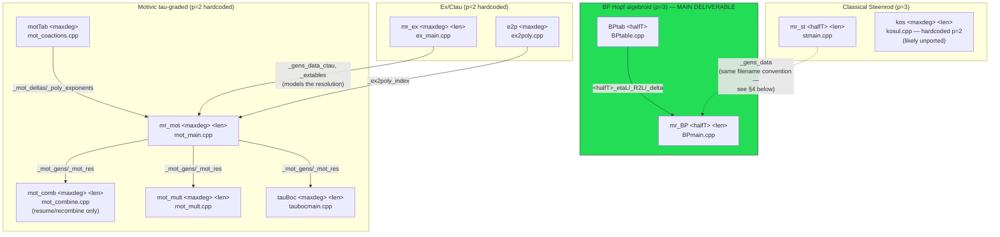

# Architecture

This document is the map of the whole repository: what it computes, how its
11 build targets relate, and where the actual prime `p` each computation runs
at diverges from the "p=3 fork" framing in the top-level README. It assumes
you'll click through to the detail docs for anything beyond the big picture:

- [`FRAMEWORK.md`](FRAMEWORK.md) — the generic, math-agnostic template layer
  (rings, modules, matrices, comodules, `Hopf_Algebroid`, `curtis_table`).
- [`pipelines/STEENROD.md`](pipelines/STEENROD.md) — `mr_st`, `kos`.
- [`pipelines/BP.md`](pipelines/BP.md) — `BPtab`, `mr_BP` (the repo's main deliverable).
- [`pipelines/MOTIVIC.md`](pipelines/MOTIVIC.md) — `motTab`, `mr_mot`, `mot_comb`, `mot_mult`, `tauBoc`.
- [`pipelines/EX_CTAU.md`](pipelines/EX_CTAU.md) — `mr_ex`, `e2p`.
- [`BUILD_AND_RUN.md`](BUILD_AND_RUN.md) — concrete build/run instructions.
- [`CLASSES.md`](CLASSES.md) — full class catalog across all four docs.
- [`GLOSSARY.md`](GLOSSARY.md) — math term ↔ code identifier index.

## 1. What this repo computes

This is Guozhen Wang's minimal-resolution machinery for computing the
**Adams–Novikov E2 page for the sphere spectrum**, forked to the prime 3, via
the **algebraic Novikov spectral sequence**: filter
`Ext_{BP_*BP}(BP_*, BP_*)` by powers of the invariant regular ideal
`I = (p, v1, v2, ...)` and read off the associated-graded Ext groups
(`docs/pipelines/BP.md` §1). The BP pipeline (`BPtab` → `mr_BP`) is the actual
deliverable; everything else in the repo is either infrastructure it's built
on (the generic framework) or a related/adjacent computation (classical
Steenrod-algebra Ext, the motivic Adams E2 page, a Koszul cross-check) that
shares the same resolution engine.

## 2. The four-layer structure

```
┌─────────────────────────────────────────────────────────────────────┐
│  Layer 4: concrete pipelines (each ties a ring + Hopf-algebroid       │
│  structure + a main() driver to the framework below)                 │
│                                                                       │
│    Steenrod (p=3)      BP (p=3)         Ex/Ctau (p=2)   Motivic (p=2)│
│    steenrod.*           BP.*, BPQ.*      ctau_steenrod.* mot_steenrod.*│
│    steenrod_init.*      BP_init.*        ex_steenrod_init.* tao_bockstein.*│
│    stmain.cpp           BPmain.cpp       ex_main.cpp     mot_main.cpp │
│    kosul.cpp            BPtable.cpp                      + 4 more    │
├─────────────────────────────────────────────────────────────────────┤
│  Layer 3: base rings                                                 │
│    Fp (F_p field)   Z3 (3-adic ints)   Qp/Q3 (p-local rationals, GMP)│
├─────────────────────────────────────────────────────────────────────┤
│  Layer 2: generic algebraic structures (math-agnostic, templated)    │
│    RingOp/AbGroupOp · ModuleOp · matrix (mem/stream/file backends)   │
│    polynomial/PolyOp_Para · CoModule/comodule_generic/cofree_comodule│
│    Hopf_Algebroid  (the resolution ALGORITHM lives here)             │
│    curtis_table (mem/stream backends) · SS_table · monomial_index    │
├─────────────────────────────────────────────────────────────────────┤
│  Layer 1: plumbing                                                   │
│    con_streams/con_fstreams (thread-safe file/stream IO)             │
└─────────────────────────────────────────────────────────────────────┘
```

Every concrete pipeline instantiates `Hopf_Algebroid<ring, algebroid>` for
its own ring/algebroid pair and gets the entire resolution algorithm
(`embed2cofree`, `resolvor`, `pre_resolution_tab`, `quotient`, ...) for free —
see `FRAMEWORK.md` §5 for exactly what that algorithm computes and where the
math-level justification (external to this repo — `MinimalResolution.pdf`) is
needed to fully understand *why* it's correct.

## 3. Executable pipeline and data flow

11 build targets total (9 "primary" executables plus 2 upstream helper tools,
`motTab` and `e2p`, that other docs found were required but not in the
original brief):



Notes on this diagram:
- **Solid arrows** are confirmed file-based dependencies (cited with
  file:line in the pipeline docs). **Dotted arrows** are inferred from
  matching filename conventions rather than a direct `load` call — see §4.
- `kos` and the four `mr_ex`/`e2p` boxes are *not* wired into the BP
  pipeline's data flow at all; they're separate computations that happen to
  reuse the same generic framework.
- `BPtab`/`mr_BP` is the only pipeline entirely self-contained and running at
  the prime the repo claims to be forked to (p=3) — see §5.

## 4. Resolving the `mr_st` ↔ `mr_BP` connection

`docs/pipelines/BP.md` flagged as `TODO(math)` that no code in `BP.cpp`/
`BP_init.cpp` visibly loads any `mr_st` output file, even though the README
lists `mr_st` as a prerequisite phase ("the minimal resolution for BP/I").
Cross-referencing the two docs resolves the *mechanism*, if not the full
mathematical justification:

- `mr_st` (`docs/pipelines/STEENROD.md` §2) writes `<maxdeg>_gens_data` via
  `SteenrodInit::save_gens` (`steenrod_init.cpp:60-70`).
- `mr_BP` (`docs/pipelines/BP.md` §2.2) *requires* `<halfT>_gens_data` via
  `BPInit::load_gens` (`BPmain.cpp:23`, `BP_init.cpp:82-95`) — a file that
  `BPtab` never produces.
- The filenames match exactly (same `<degree-argument>_gens_data` pattern),
  and the README instructs running `mr_st` before `mr_BP` on the same
  half-degree argument. This strongly suggests **`mr_st`'s `_gens_data`
  output is literally the file `mr_BP` expects** — i.e. the classical
  Steenrod-algebra resolution's generators (computed via the
  `BP_*BP/I ≅ A_*` identification, `docs/pipelines/STEENROD.md` §1) seed the
  BP resolution's generator choices, the same "modeled resolution" pattern
  used elsewhere in this codebase (`mr_ex` → `mr_mot`, `docs/pipelines/
  MOTIVIC.md` §2).
- **Still open (`TODO(math)`):** *why* this transport is mathematically
  valid — i.e. why a minimal generating set for `Ext_{A_*}(F_3,F_3)` doubles
  as a minimal generating set for the `BP_*BP` resolution — is the same kind
  of "modeled resolution" justification flagged as unresolved in both
  `FRAMEWORK.md` §5 (`resolvor_modeled`) and `MOTIVIC.md` §5. This is exactly
  the kind of thing `MinimalResolution.pdf` (referenced by the README, not
  present in this repo) would explain.

## 5. The "p=2 vs p=3" split — the most important thing to know before reading code

Despite the repo's framing as **"a p=3 fork"** of the original p=2 codebase,
cross-referencing all four pipeline docs shows the fork is **partial**:

| Pipeline | Executable(s) | Prime | Evidence |
|---|---|---|---|
| Classical Steenrod | `mr_st` | **3** | `stmain.cpp:11`, `SteenrodInit st(3, ...)` |
| BP Hopf algebroid | `BPtab`, `mr_BP` | **3** | `Z3` = 3-adic integers throughout; `BPtable.cpp`/`BPmain.cpp` |
| Koszul | `kos` | 2 | `kosul.cpp:47`, `SteenrodInit st(2, ...)` |
| Ex/Ctau | `mr_ex` | 2 | `ex_main.cpp:11`, `SteenrodInit st(2, ...)` |
| Motivic | `motTab`, `mr_mot`, `mot_comb`, `mot_mult`, `tauBoc` | 2 (?) | `mot_steenrod.cpp`'s `tauOper::add` and `MotSteenrodOp::lift` implement mod-2 arithmetic (`x%2!=0` tests) despite `F3`-named types — see `MOTIVIC.md` §1 |

**Practical implication:** if you're trying to reproduce or extend the p=3
algebraic-Novikov E2-page computation (the repo's stated goal), the pipeline
you want is exclusively **`mr_st` → `BPtab` → `mr_BP`**. The ex/ctau and
motivic pipelines, and `kos`, are auxiliary/adjacent computations that — per
current code — are not actually running at p=3, and it's an open question
(flagged `TODO(math)`/`TODO(code)` in the respective docs) whether that's
intentional (e.g. deliberately kept at p=2 because the motivic story is only
being explored at p=2 for now) or simply an unfinished part of the port.

## 6. Known dead/duplicate code (worth cleaning up)

Found while documenting, not something introduced by this documentation
effort — listed here so it's in one place instead of scattered across four
docs:

| File(s) | Issue | Detail |
|---|---|---|
| `others.h` | Dead, incompatible second `curtis_table`/`matrix_array`/`quasi_table` hierarchy under nonexistent namespaces; `#include`s a nonexistent `filedmatrices.h`; not included anywhere | `FRAMEWORK.md` §3 note |
| `lift.h` | Looks non-compiling as written (wrong-arity call, references a nonexistent member) | `FRAMEWORK.md` §3 note |
| `expoly.h` | Byte-for-byte duplicate of `ex_exponents.h`, unreferenced by any file | `EX_CTAU.md` §3/§5 |
| `ex_test.cpp` | Orphaned scratch test, not in any compile script | `EX_CTAU.md` §5 |
| `tao_boc.cpp` | Pre-refactor snapshot superseded by `tao_bockstein.cpp`, uses namespaces/types that no longer exist | `EX_CTAU.md` §5 |
| `Qptest.cpp` | References `Q2_Op`/`Q2_int`, which don't exist in current `Qp.h` — predates the p=3 fork, not in any compile script | `BP.md` §6 |

## 7. The numbered-fragment file convention

If you haven't read it yet, `FRAMEWORK.md` §2 explains a convention used
throughout the framework layer: headers like `matrices.h`, `modules.h`,
`hopf_algebroid.h` are pure `#include` manifests over a directory of
numbered fragment files (`matrices/1.h`...`matrices/9.h`, etc.) where most
fragments are out-of-line method bodies for a class declared in an
earlier-numbered fragment — **except** `matrices/9.h`, which is a trap: it's
an entirely separate class (`curtis_table`) that just happens to share the
directory. Read that section before diving into any of the framework
source files.
