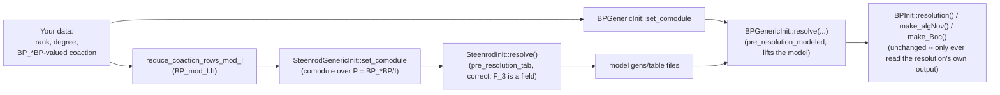

# Computing the E2 Page for a General Comodule

By default, this repo computes the algebraic Novikov E2 page only for the
**sphere**: `mr_BP` resolves the trivial `BP_*BP`-comodule `BP_*` itself (see
`docs/CODE_WALKTHROUGH.md` §3 for exactly where `set_to_trivial` builds
that). This page documents a new, additive capability — `BP_generic_init.h`/
`.cpp`, `Steenrod_generic_init.h`/`.cpp`, `BP_mod_I.h`/`.cpp`, and
`mr_BP_generic_example.cpp` — for computing the same kind of E2 page for
**any** finitely generated `BP_*BP`-comodule `M` that is free over `BP_*`
(e.g. the BP-homology of a finite complex), given as a rank, a per-generator
degree, and a coaction matrix.

Nothing in the existing pipeline is modified; this is purely additive.

## Why this isn't a one-line change

The obvious approach — build a `comodule_generic<BPBP,int>` from your own
data instead of calling `set_to_trivial`, then call
`Hopf_Algebroid::pre_resolution_tab` directly — **does not work**, and the
reason is worth understanding before using this:

`PolyOp::invertible(x)` (`polynomial/6.h:27-28`), which `curtis_table`'s
pivot-finding (`symplify_to_led`) relies on to decide whether a leading term
is "already accounted for," only recognizes an element as invertible if it's
a bare constant *and* that constant is itself invertible in the base ring.
For `BP = BP_* = Z_(3)[v_1,v_2,...]`, that means an element is invertible
only if it has **no `v_i`'s in it at all**. Almost anything a real coaction
produces (`η_R(v_1)`, anything genuinely involving the `v_i`'s) is never
invertible by this test — so the pivot search that `pre_resolution_tab`
relies on can't reliably find pivots when the ring is `BP_*` itself. This
isn't a corner case: it's why the *existing*, shipped `mr_BP` never calls
`pre_resolution_tab` with `ring=BP` at all — it exclusively uses the
"modeled" path (`pre_resolution_modeled`), which never searches for pivots
over `BP_*`; it reuses pivots already found on the `F_3` side (a genuine
field, where every nonzero element is invertible) and only *lifts* the
resulting values into `BP_*BP` via `BP_Op::lift`.

(This was found by testing, not just reasoning: an earlier version of this
feature that called `pre_resolution_tab` directly over `BP` compiled cleanly
but produced an empty algebraic Novikov page for the sphere, where the known
answer has several classes — a concrete illustration of why every nontrivial
change here should be checked against a case with an already-known answer,
not just compiled.)

## Is "reduce mod `I`, then resolve, then lift" new? No

It's tempting to read the two-phase approach below as a new architecture
introduced for the general case. It isn't — **the sphere's own E2-page
computation already works exactly this way**; see
`docs/CODE_WALKTHROUGH.md` §4.0 for the precise, function-by-function
trace. In brief: `BP_*` is the simplest possible `BP_*BP`-comodule (one
generator, coaction "1 times itself"), so its reduction mod `I` has a
one-line answer that doesn't need computing — that one-liner *is*
`set_to_trivial` (`hopf_algebroid/12.h:1-12`), called on the `P` side by
`mr_st` (`steenrod_init.cpp:32`). `mr_st` resolving that reduction and
`mr_BP` lifting it (`BP_init.cpp:43-54`) are phases 2 and 3 of the exact
same pattern used below. The only genuinely new piece for a general `M` is
`BP_mod_I.cpp`'s reduction functions — a real computation, because a general
`M`'s mod-`I` reduction isn't simple enough to hardcode by hand the way
`set_to_trivial` does for `BP_*` itself.

## The two-phase approach

1. **Reduce `M` mod `I = (p, v_1, v_2, ...)`** to get a comodule over
   `P = BP_*BP/I` — a genuine field-based Hopf algebra (`F_3[t_1,t_2,...]`).
   Since `M` is free over `BP_*`, this reduction is always well-defined, and
   it's exactly the general `M`/`M/I` language `MinimalResolution.pdf` §5
   already uses (not specific to `M = BP_*`). `BP_mod_I.h`'s
   `reduce_coaction_rows_mod_I` derives this automatically from your
   `BP_*BP`-valued coaction — you only enter your comodule's data once.
2. **Resolve that reduction with the classical (Steenrod-style) machinery**
   — `SteenrodGenericInit::set_comodule` + the inherited
   `SteenrodInit::resolve()`, i.e. `pre_resolution_tab` over `ring=Fp`. This
   *does* work correctly, since `F_3` is a field.
3. **Lift that resolution to `BP_*BP` via `pre_resolution_modeled`** —
   `BPGenericInit::set_comodule` + `BPGenericInit::resolve(model_gens_data,
   model_table_file)`, pointed at the files phase 2 wrote, exactly mirroring
   how `mr_BP` already lifts `mr_st`'s resolution for the sphere.

## How to use it

1. Copy `mr_BP_generic_example.cpp` to a new name (e.g. `mr_BP_myComplex.cpp`)
   and make a copy of `BP_generic_compile` that builds it instead.
2. Edit `build_comodule()` in your copy: set `rank`, `degree`, and
   `coaction_rows` for your complex. `coaction_rows(i)` must return generator
   `i`'s coaction as a sparse `vectors<matrix_index,BPBP>` — a list of
   `(j, c)` pairs, `j` the index of another generator (0..rank-1), `c` a
   `BP_*BP` element built with `BP_oper.BPBP_opers`'s ring operations
   (`.unit(1)`, `.monomial(e,coeff)`, `.add(x,y)`, `.multiply(x,y)`). See the
   comments in the file for a worked example (it ships reconstructing the
   trivial comodule, as a self-test — see below).
3. Build and run exactly like `mr_BP`, after a matching `BPtab <halfT>` run:
   `./mr_BP_myComplex <halfT> <resolution_length>`.

Output files use two internal prefixes: `<halfT>_gP...` for the phase-2
(model) resolution over `P`, and `<halfT>_gBP...` for the final phase-3
resolution and its `algNov`/`Boc` tables (e.g. `<halfT>_gBPAANSS_table.txt`) —
chosen to avoid colliding with a real `mr_st`/`mr_BP` run's own files
(`<halfT>_...`/`<halfT>_BP...`) in the same directory.

## Verifying a change here

Because resolving the trivial comodule through this new path should produce
*exactly* the same answer as the existing `mr_BP` (they're computing the
same thing, `Ext_{BP_*BP}(BP_*,BP_*)`, just via different code paths), the
shipped `build_comodule()` reconstructs the trivial comodule by default.
Comparing its `algNov`/`Boc` output against a normal `mr_st`+`BPtab`+`mr_BP`
run for the same `<halfT>`/`<resolution_length>` is a real regression test,
not just a smoke test — this is how the from-scratch-over-`BP` approach
above was caught as incorrect, and how the corrected, two-phase approach was
confirmed correct (byte-identical `algNov`/`Boc` tables at two different
degree ranges, including one with a nontrivial differential). If you change
anything in `BP_generic_init.*`, `Steenrod_generic_init.*`, or `BP_mod_I.*`,
re-run this comparison before trusting the result on a real complex.

## Caveats

- **No comodule-axiom verification.** Nothing here checks that the coaction
  you supply actually satisfies coassociativity or counitality. A mistake
  won't crash — it will silently produce a wrong `Ext` computation.
  `set_comodule` only checks that your data is structurally well-formed
  (indices in range, rows sorted).
- **Same degree-range and generator-count limits as the rest of the
  pipeline** — bounded by `max_degree`/`monomial_index`, and by the shared
  `exponents.h` table's generator cap (`v_1..v_5`/`t_1..t_5`), exactly as for
  the sphere computation.
- **"Free over `BP_*`" is assumed, not checked.** This matches the
  framework's blanket assumption throughout (`comodule_generic` has no
  notion of torsion), per `MinimalResolution.pdf` Definition 1.
