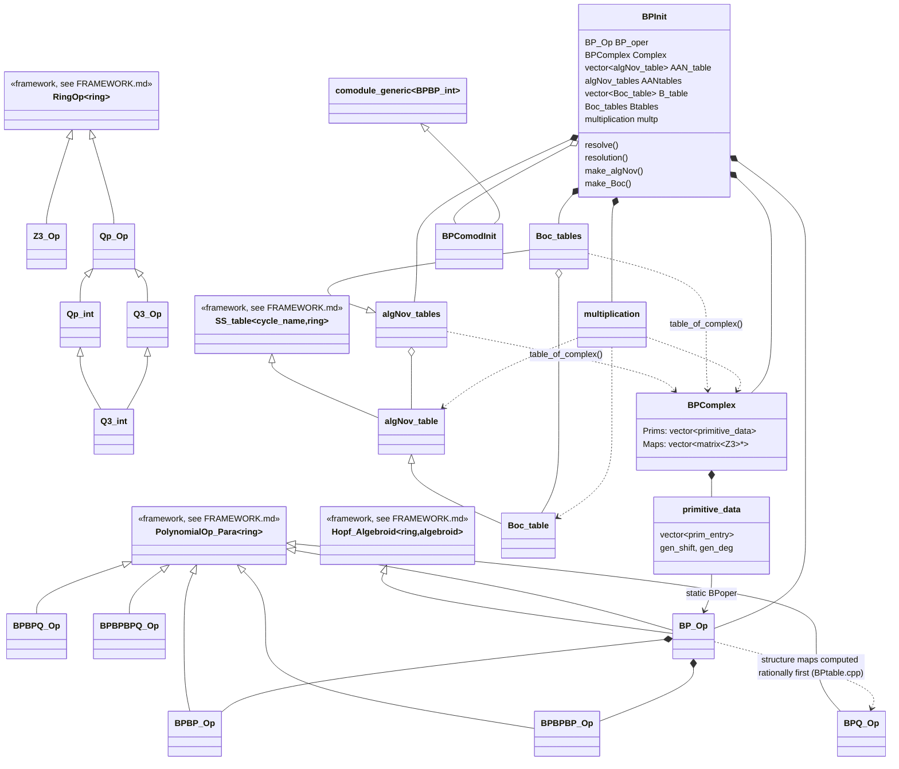

# The BP Pipeline

This document covers the Brown–Peterson (BP) Hopf-algebroid subsystem: the code that computes
the structure maps of `(BP_*, BP_*BP)` at p=3, runs a minimal resolution of `F3` over that
Hopf algebroid, and packages the result as the E2-page of the algebraic Novikov spectral
sequence (algNov), plus a secondary Bockstein spectral sequence (Boc) and multiplicative
structure. It assumes the generic template framework (`matrix<ring>`, `ModuleOp`,
`CoModule`/`comodule_generic`, `Hopf_Algebroid<ring,algebroid>`, `curtis_table`,
`monomial_index`, `polynomial<ring>`, `RingOp`/`AbGroupOp`, `SS_table`) described in
`docs/FRAMEWORK.md` and only documents how the BP-specific code instantiates and drives it.

## 1. Purpose

- **Deliverable**: the repo's end goal is the E2-page of the Adams–Novikov spectral sequence
  for the sphere at p=3, computed via the **algebraic Novikov spectral sequence**: filter
  `Ext_{BP_*BP}(BP_*,BP_*)` by powers of the invariant regular ideal `I = (p, v1, v2, ...)`
  (README.md:5-7; the ideal generators are literally what `algNov_table::v_valuation` and
  `naming` track — the cycle name tuple is `(filtration, v0-valuation, v1-exp, ..., v5-exp)`,
  algNov.cpp:15-35).
- `BP_* = Z3[v1,v2,...]` and `BP_*BP = BP_*[t1,t2,...]` are constructed as polynomial rings
  (BP.h:11-15). The associated graded of the I-adic filtration on a `BP_*BP`-comodule is a
  comodule over `BP_*BP/I`, which is (up to regrading) the dual Steenrod algebra `A_*` — this
  is why the README's *first* phase (`mr_st`, built from `steenrod.cpp`/`steenrod_init.cpp`/
  `stmain.cpp` via `st_compiling`) is described as computing "the minimal resolution for BP/I":
  it resolves `F3` over `(F3, A_*)`, not over `(BP_*, BP_*BP)`. That resolution and its driver
  files (`steenrod*.cpp`, `stmain.cpp`, `ex_*`, `curtis.h`) are **outside** the BP files read for
  this document; they are noted here only because the README lists `mr_st` as a prerequisite
  phase.
  **TODO(math):** confirm precisely how (or whether) `mr_st`'s output is consumed by `BPtab`/
  `mr_BP` — no `load_*` call in `BP.cpp`/`BP_init.cpp` reads any `mr_st` output file, so the two
  phases may be independent computations that are only compared/interleaved by hand or by a tool
  not covered here.
- **`BPComplex` is not "BP/I".** Reading `BPcomplex.cpp` shows `primitive_data` /
  `BPComplex` build the **complex of primitives of the resolution itself**: for each cofree
  generator of each term of the `BP_*BP`-comodule resolution, it enumerates monomials
  `v^e` (`monomial_index::mon_array`) up to the degree budget, i.e. the underlying free
  `BP_*`-module basis of that resolution term (BPcomplex.cpp:45-52, 61-66). The differential
  on primitives is `etaR(v^e)` shifted into the next term (BPcomplex.cpp:16-33). This complex is
  the input the algebraic Novikov filtration (I = (p,v1,...)) is read off of — it is the
  BP_*-linear resolution, not a BP/I quotient object.

## 2. Executables

### 2.1 Build

| Executable | Compile command | Source files |
|---|---|---|
| `BPtab` | `g++ -std=c++11 -O2 -fopenmp Z3.cpp mon_index.cpp BP.cpp BPQ.cpp BPtable.cpp exponents.cpp Qp.cpp Fp.cpp -I./ -lgmp -lgmpxx -Wall -Wfatal-errors -oBPtab` (BPtable_compile:1) | `BPtable.cpp` (main) |
| `mr_BP` | `g++ -O2 BPcomplex.cpp streams.cpp algNov.cpp Boc.cpp multiplication.cpp exponents.cpp Fp.cpp mon_index.cpp Z3.cpp BP.cpp BP_init.cpp BPmain.cpp -std=c++11 -I./ -Wall -Wfatal-errors -fopenmp -omr_BP` (BP_compile:1) | `BPmain.cpp` (main) |

`BPtab` links GMP (`-lgmp -lgmpxx`) because it works with the rational Hopf algebroid `BPQ`
(exact `mpz_class` numerators, Qp.h:9); `mr_BP` does not need GMP because by the time it runs,
everything is already reduced to `Z3` (64-bit fixed-precision 3-adic integers, Z3.h:8).

### 2.2 Args and required run order

- `./BPtab <halfT>` — `halfT` is used directly as `max_degree` for `monomial_index` and for the
  `BPQ_Op`/`BP_Op` constructors (BPtable.cpp:8-20,40). Output files are all prefixed
  `"<halfT>_"` (BPtable.cpp:14-15): `<halfT>_structures`, `<halfT>_R2L_gen`,
  `<halfT>_delta_gen` (rational intermediate tables, BPtable.cpp:23-35), then
  `<halfT>_Ls`, `<halfT>_etaL`, `<halfT>_R2L`, `<halfT>_delta` (final integral structure-map
  tables, written by `BP_Op::make_tables`, BPtable.cpp:44-45).
- `./mr_BP <halfT> <resolution_length>` — must be called with the **same `<halfT>`** as the
  `BPtab` run whose output it loads. `BPmain.cpp:13-18` builds `filename0 = "<halfT>_"` and
  passes `filename0+"etaL"`, `filename0+"R2L"`, `filename0+"delta"` into `BPInit`, which in turn
  calls `BP_Op::initialize` → `load_etaL`/`load_R2L`/`load_delta` (BP_init.cpp:20,
  BP.cpp:30-51). These are exactly the three files `BPtab` wrote. `mr_BP` additionally expects a
  `<halfT>_gens_data` file (`BPInit::load_gens`, BPmain.cpp:23, BP_init.cpp:82-95) that is **not**
  produced by `BPtab` at all — it must come from elsewhere (hand-authored seed generators for
  the resolution; not covered by the files read here).
  **TODO(math)/TODO(build):** no file in this pipeline appears to write `<halfT>_gens_data`;
  confirm its origin (likely produced by the `mr_st`/steenrod phase or supplied by hand).
  All of `mr_BP`'s own output is written under a *second* prefix, `filename = "<halfT>_BP"`
  (BPmain.cpp:15, BP_init.cpp:9's `dirname` argument), e.g. `<halfT>_BPetaL_matrix`,
  `<halfT>_BPmaps`, `<halfT>_BPgens`, `<halfT>_BPres`, `<halfT>_BPcpx`,
  `<halfT>_BPAANSS_table_binary`/`.txt`, `<halfT>_BPBocSS_table_binary`/`.txt`, etc.
- **Why the order matters**: `BP_Op` is constructed in "structure-tables-unknown" mode by
  `BPtable.cpp:40` (`etaL_mat` set, `delta_mat`/`R2L_mat` = `NULL`) purely to *compute* the
  tables; `BPmain.cpp` constructs a fresh `BP_Op` (inside `BPInit`) that is unusable until
  `load_etaL`/`load_R2L`/`load_delta` succeed, i.e. until `BPtab` has already produced those
  three files for the matching `<halfT>`. There is no dependency the other way.
- **Degree convention**: `<halfT>` is passed straight through as `max_degree` to
  `monomial_index` (BPtable.cpp:10, BP_init.cpp:9), and `monomial_index` bounds monomials by
  `total_deg(e)` using `xnDeg(n) = 2(3^n-1)` (exponents.cpp:29, the *un-halved* topological
  degree `|v_n|`). The README's "first parameter is half of t" warning appears to be inherited
  verbatim from Guozhen Wang's original p=2 code; nothing in this p=3 BP code path visibly
  halves the degree again before comparing to `xnDeg`.
  **TODO(math):** determine whether "half of t" is still literally correct for this p=3 fork or
  is a stale carry-over from the p=2 version (the README itself flags this uncertainty at
  README.md:52).
- **Segfault mechanism (mismatched parameters)**: `matrix<R>::load(reader, rk)` (matrices/4.h:
  30-37) reads exactly `rk` rows by repeatedly calling `ModuleOp<index,R>::load` (modules/5.h:
  40-49), which reads a **raw, unchecked `int32_t length`** from the stream and then loops
  `length` times reading `(index, coefficient)` pairs — there is no check that `length` is
  sane or that the stream has that much data left. `rk` itself is
  `mon_index.number_of_all_mons()` (BP.cpp:33,41,49), which is a function of the `<halfT>`/
  `max_degree` passed to the *currently running* executable, not of the file's actual contents.
  If `mr_BP` is invoked with a `<halfT>` different from the one used to generate the `etaL`/
  `R2L`/`delta` files (or if those files are truncated/from a different max-degree run), the
  read cursor desyncs from record boundaries; the next `length` field read is then essentially
  garbage (can be enormous or negative-as-huge-unsigned), and the subsequent per-term read loop
  attempts to allocate/read far past the file, producing a crash (typically `std::bad_alloc`,
  an out-of-bounds read, or a straightforward segmentation fault) — matching the README's
  "unpredictable behaviour ... usually a break-down ... such as a segmentation error"
  (README.md:50).

## 3. Class catalog

| Class | File | Template Params | Base Classes | Purpose |
|---|---|---|---|---|
| `Z3_Op` | Z3.h:13 | — (ring = `uint64_t` alias `Z3`) | `virtual RingOp<Z3>` | Ring of 3-adic integers truncated mod `3^40` (fits in 64 bits); add/multiply/invert/valuation/`divide` by `p^n`, lift from residue field `F3=Fp` (Z3.cpp:5-152). |
| `Qp_Op` | Qp.h:18 | — (ring = `Qp` struct: `mpz_class` numerator + `int16_t` valuation) | `virtual RingOp<Qp>` | Arbitrary-precision p-local rationals via GMP; `prime()` is pure virtual (abstract over p). |
| `Q3_Op` | Qp.h:62 | — | `virtual public Qp_Op` | Fixes `prime()=3`. |
| `Qp_int` | Qp.h:67 | — | `virtual public Qp_Op` | Overrides `save` to serialize only the truncated 64-bit integer part (`int_part`), not the full `Qp`. |
| `Q3_int` | Qp.h:73 | — | `virtual public Qp_int, virtual public Q3_Op` | p=3 + integral-IO combination; overrides `output` to print the truncated integer. |
| `BPQ_Op` | BPQ.h:38 | — (rings `BPQ=polynomial<Qp>`, `BPBPQ=polynomial<BPQ>`, `BPBPBPQ=polynomial<BPBPQ>`) | `virtual public PolynomialOp_Para<Qp>` | The **rational** Hopf algebroid `BP_*⊗Q`. Builds `li`⇄`vn` change-of-basis tables and the rational `etaR`/`delta` structure maps by direct recursive formulas over `Q`(BPQ.cpp:17-83), so no mod-p division problems arise. |
| `BPBPQ_Op` | BPQ.h:18 | — | `PolynomialOp_Para<BPQ>` | Ring ops on `BP_*BP⊗Q`; `construct(n,s1,k,s2,coef)` builds `coef·v_n^{s1}[t_k^{s2}]`. |
| `BPBPBPQ_Op` | BPQ.h:28 | — | `PolynomialOp_Para<BPBPQ>` | Ring ops on `BP_*BP⊗BP_*BP⊗Q` (used for `delta`); `construct` builds `v_n^s[t_{k1}^{i1}|t_{k2}^{i2}]`. |
| `BP_Op` | BP.h:33 | — (rings `BP=polynomial<Z3>`, `BPBP=polynomial<BP>`, `BPBPBP=polynomial<BPBP>`) | `virtual public Hopf_Algebroid<BP,BPBP>`, `public PolynomialOp_Para<Z3>` | The **integral/mod-3ⁿ** Hopf algebroid `(BP_*,BP_*BP)`; owns the loaded `etaL_table`/`delta_table`/`R2L_table` matrices, implements `etaL`, `etaR`, `R2L`, `delta`, `algebroid2vector`, `divide_power_p`, `divide_v1`, `h0()`, `thetas()`. |
| `BPBP_Op` | BP.h:21 | — | `PolynomialOp_Para<BP>` | Ring ops on `BP_*BP`. |
| `BPBPBP_Op` | BP.h:27 | — | `PolynomialOp_Para<BPBP>` | Ring ops on `BP_*BP⊗_{BP_*}BP_*BP` (target of `delta`). |
| `BPComodInit` | BP_init.h:11 | — | `BPCoMod_generic` = `comodule_generic<BPBP,int>` | Loads a generic `BP_*BP`-comodule's coaction matrix from a file (constructed once, initialized to the trivial rank-1 comodule by `BP_Op::set_to_trivial`). |
| `BPInit` | BP_init.h:19 | — | (none; a plain driver/aggregator class) | Owns every operator/table object for one `mr_BP` run (`Z3_Op`, `BP_Op`, matrix files, `BPComplex`, `algNov_table`s/`algNov_tables`, `Boc_table`s/`Boc_tables`, `multiplication`); exposes `resolve()`, `resolution()`, `make_algNov()`, `make_Boc()`, `mult_table()`, `mult_theta()` as the pipeline steps. |
| `prim_entry` | BPcomplex.h:6 | — | (none) | One primitive basis element `v^coeficient[gen_pos]`: a monomial exponent paired with a generator index. |
| `primitive_data` | BPcomplex.h:21 | — | `public std::vector<prim_entry>` | The full primitive basis of one resolution term (list of `prim_entry` + parallel `gen_shift`/`gen_deg` arrays + a `prim_index` lookup map); static `BPoper`/`Z3Mod_oper` shared across all instances. |
| `BPComplex` | BPcomplex.h:56 | — | (none) | The chain complex of primitives: `Prims[i]` (basis) and `Maps[i]` (`matrix<Z3>*`, the differential in terms of primitives) for each homological degree, built from a stored comodule resolution (`load`) or from disk (`load_matrix`). |
| `algNov_table` | algNov.h:12 | `cycle_name = pair<vector<int>,int>`, `ring=Z3` (via `SS_table<cycle_name,Z3>`) | `virtual SS_table<cycle_name,Z3>` | One homological degree's algebraic-Novikov E1/Curtis table: names cycles by `(v-adic filtration, v0-valuation, v1-exp,...,v5-exp, gen_pos)` (algNov.cpp:20-35), implements the `SS_table` pure-virtual hooks (`naming`, `leading_term`, `save`/`load`, `output`, `valid`, `tagged`, `invalid`, `cycle_pot`, `get_tag`). |
| `algNov_tables` | algNov.h:84 | — | (none) | Owns one `algNov_table*` per homological degree; `table_of_complex` wires `Ptag`/`Pcyc` (adjacent `BPComplex::Prims`) and calls `SS_table::make_table` per degree (algNov.cpp:183-195); aggregate `save`/`load`/`output_tables`. |
| `Boc_table` | Boc.h:8 | (inherits algNov_table's) | `public algNov_table` | Bockstein spectral sequence table: same cycle-name machinery but `v_valuation` overridden to count **only** powers of `v0=p` (Boc.cpp:4-6), so filtration tracks 3-divisibility, not the full v_i-adic filtration; adds `Bname2Aname` to relate Bockstein names back to algebraic-Novikov names. |
| `Boc_tables` | Boc.h:29 | — | `public algNov_tables` | Same aggregation as `algNov_tables` but over `Boc_table`s; explicitly poisons the inherited `set_table(vector<algNov_table>*)` overload (Boc.cpp:8-10) to stop misuse, requiring the `vector<Boc_table>*` overload. |
| `multiplication_table_entry<cycle_name>` | multiplication.h:8 | `cycle_name` | (none) | One row of a multiplication table: an `original_name` and the `(tag-names, cycle-names)` pair it multiplies to. |
| `multiplication` | multiplication.h:20 | — | (none) | Computes multiplicative structure on the algNov/Boc tables: `make_eta_R_multiplier` (matrix of `x ↦ η_R(x)·(given BPBP element)`), `mult_extension`/`mult_extension1` (push a table's entries through a multiplier matrix and re-name the result in the next table), `three_extension` (multiplication by the integer 3), and various `output_multiplication_table*` pretty-printers. |

## 4. Data flow

```
BPtab <halfT>                                                   [BPtable.cpp]
 1. monomial_index mon_index(halfT)                                        (BPtable.cpp:10)
 2. Q3_Op/Q3_int + BPQ_Op(maxVar) — RATIONAL Hopf algebroid              (BPtable.cpp:18-20)
      BPQ_Op ctor recursively builds li<->vn change of basis and the
      rational etaR/delta tables purely over Q                        (BPQ.cpp:17-83)
 3. write <halfT>_structures  (human-readable li/vn/etaR)              (BPtable.cpp:23-27)
 4. write <halfT>_R2L_gen, <halfT>_delta_gen                             (BPtable.cpp:30-35)
      (rational etaR-in-terms-of-vn and delta-in-terms-of-vn generators,
       output_R2L / output_delta on BPQ_Op                              BPQ.cpp:248-263)
 5. fresh BP_Op(halfT, etaL_mat, delta_mat=NULL, R2L_mat=NULL)          (BPtable.cpp:40)
 6. BP_Op::make_tables(...)                                             (BP.cpp:126-209)
      - loads <halfT>_R2L_gen / <halfT>_delta_gen generator values
      - RECURSIVELY computes etaL_gen[i] from R2L_gen using the Hopf-
        algebroid identity  etaL(v_n) = v_n - etaR(v_n) + etaR(v_n)   (BP.cpp:153-176)
      - expands every generator's formula to ALL monomials up to halfT
        via monomial_index::substitution_table                        (BP.cpp:177-208, mon_index.h:37-63)
      - writes the 3 FINAL binary tables read by mr_BP:
          <halfT>_etaL, <halfT>_R2L, <halfT>_delta                     (BP.cpp:180-192,206-208)
      - also writes <halfT>_Ls (human-readable etaR(v_i)/delta(t_i))    (BPtable.cpp:44-45)

mr_BP <halfT> <resolution_length>                                [BPmain.cpp]
 1. BPInit ctor: BP_Op::initialize(<halfT>_etaL,<halfT>_R2L,<halfT>_delta)
      -> load_etaL/load_R2L/load_delta  == the exact 3 files BPtab wrote (BP.cpp:30-51, BP_init.cpp:20)
      -> init_cofree_data (framework: Hopf_Algebroid, hopf_algebroid/12.h)
      Also sets up primitive_data::set_oper, algNov_table::set_op,
      trivial rank-1 comodule at degree 0 via BP_Op::set_to_trivial   (BP_init.cpp:23,30,33)
 2. BPoper.load_gens(<halfT>_gens_data)                                (BPmain.cpp:23)  -- external input, not produced by BPtab
 3. BPoper.resolve()
      -> Hopf_Algebroid<BP,BPBP>::pre_resolution_modeled(...)         (BP_init.cpp:50, hopf_algebroid/6.h:41)
         builds the minimal resolution of BP_*BP-comodules term by
         term, writing <halfT>_BPmaps / <halfT>_BPgens / <halfT>_BPtables
      -> gens_file_combiner                                            (BP_init.cpp:53, hopf_algebroid/6.h:123)
 4. BPoper.resolution()
      -> Hopf_Algebroid<...>::resolution(...)                          (BP_init.cpp:60, hopf_algebroid/8.h:4)
         re-walks the stored maps/gens and materializes matrices in mapses[]
      -> BPComplex::load(...)                                          (BP_init.cpp:67, BPcomplex.cpp:121-150)
         converts the comodule resolution into the COMPLEX OF PRIMITIVES
         (free BP_*-module basis per generator + differential matrices Maps[i])
      -> Complex.save_matrix(<halfT>_BPcpx)                            (BP_init.cpp:68, BPcomplex.cpp:153-157)
 5. BPoper.make_algNov()                                               (BP_init.cpp:98-109)
      -> Complex.load_matrix(...)
      -> AANtables.table_of_complex(Complex, resolution_length)
           per-degree SS_table<cycle_name,Z3>::make_table using the
           I=(p,v1,...)-adic filtration naming                        (algNov.cpp:183-195, algNov.cpp:15-35)
      -> save <halfT>_BPAANSS_table_binary / .txt (the algNov E2-page tables)
      -> multp.three_extension(...) -> <halfT>_BPAANSS_a0.txt (mult-by-3 / a0 extension)
 6. BPoper.make_Boc()                                                  (BP_init.cpp:112-127)
      -> Btables.table_of_complex(Complex, resolution_length)
           same machinery, but Boc_table::v_valuation counts ONLY
           powers of p (Boc.cpp:4-6) => Bockstein spectral sequence
      -> save <halfT>_BPBocSS_table_binary / .txt
      -> Btables.Bname2Anames(...) -> <halfT>_BPB2A_table.txt (Boc name -> algNov name map)
      -> multp.three_extension(...) -> <halfT>_BPBocSS_a0.txt
 7. BPoper.mult_table() / mult_theta(resolution_length)                (BP_init.cpp:129-187)
      -> BP_Op::h0() = (etaR(v1)-etaL(v1))/p                            (BP.cpp:240-250)
      -> BP_Op::thetas() = d(v2^k)/v1^j  Massey-product-like elements   (BP.cpp:253-340)
      -> multp.make_eta_R_multiplier + mult_extension/mult_extension1
         -> <halfT>_BPAANSS_h0.txt, <halfT>_BPBocSS_h0.txt,
            <halfT>_BPBocSS_theta{2..7}.txt  (multiplication-by-h0 / theta_i tables)
```

## 5. Key relationships



## 6. Open math questions

- **TODO(math):** What exactly is "Boc"? The code only tells us mechanically that `Boc_table`
  is `algNov_table` with `v_valuation` redefined to count powers of `p` alone instead of the
  full v-adic filtration (Boc.cpp:4-6), i.e. it appears to be the **Bockstein spectral
  sequence** associated to reduction mod 3 (consistent with the name), used to detect
  multiplication-by-3 (`three_extension`) differentials on top of the algebraic Novikov page.
  The precise relationship between "Bockstein SS here" and the classical mod-p Bockstein SS for
  computing integral vs. mod-p Ext, and why it's derived from the *same* primitive complex as
  algNov rather than an independent computation, isn't stated in comments anywhere read.
- **TODO(math):** The exact mathematical role of `BP/I` (`I=(p,v1,v2,...)`) as a *second
  resolution phase* (the README's `mr_st`/"minimal resolution for BP/I") relative to this BP
  pipeline is not fully recoverable from the files read here — no code in `BP.cpp`/`BP_init.cpp`
  consumes `mr_st`'s output, and `BPComplex` (despite superficially resembling a "BP/I" object)
  is actually the primitive-basis presentation of the BP resolution itself, not a BP/I quotient.
  Confirm with `steenrod.cpp`/`steenrod_init.cpp`/`ex_*` (out of scope here) whether/how the two
  phases' outputs are meant to be compared.
- **TODO(math):** `BP_Op::divide_power_p` and `BP_Op::divide_v1` (BP.cpp:343-382) implicitly
  assume their arguments are actually divisible by `p^n` / `v1^n` (no remainder is checked for
  `divide_power_p`; `divide_v1` prints `"not v1-divisible"` to stderr but does not abort or
  correct the computation, BP.cpp:377). Why these divisions are always mathematically valid at
  their call sites (`h0()`, `thetas()` — both differences of `etaL`/`etaR` on elements known to
  be primitive/invariant mod the relevant power) is a consequence of the Hopf-algebroid identity
  `etaR - etaL ≡ 0 mod I`, but the code does not document *why* e.g. `d(v2^k)` is always
  `v1`-divisible exactly once vs. three times (the `beta_i` vs `beta_i/3` naming in `thetas()`,
  BP.cpp:264-334) — this reflects specific Novikov/Greek-letter element computations not
  explained in-line.
- **TODO(math):** `Z3_Op::divide` (Z3.cpp:144-147) is flagged by an existing reviewer comment
  ("I'm concerned because I have no idea what that comment refers to... FIXME", Z3.cpp:141-143)
  as using signed 64-bit division to approximate an exact p-adic division; whether this can
  silently produce a wrong low-order digit for values near the `2^63`/`3^40` boundary is not
  resolved in this pass.
- **Stale/orphaned file noted in passing:** `Qptest.cpp` references `Q2_Op`/`Q2_int`, which do
  not exist anywhere in `Qp.h`/`Qp.cpp` (only `Q3_Op`/`Q3_int` are defined) — it is not part of
  either compile script (`BP_compile`, `BPtable_compile`) and appears to predate the p=3 fork
  (would not compile as-is).
